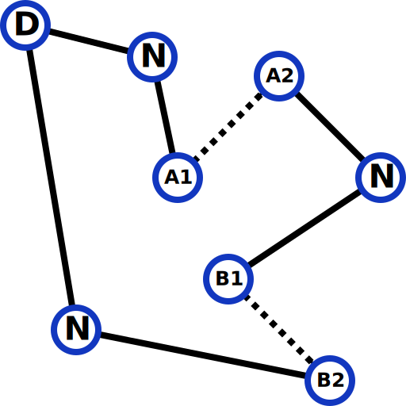

# Entry-Exit Nodes
OR-Tools samples with refill station having entry and exit.




Potentiel Output:
```sh
./problem.py
...
Objective: 4471
Dropped nodes: 1 2 4 5 7 9 10
Route for vehicle 0:
0 Fuel(26254) Time(0,0) Slack(0,0) -> 22 Fuel(17989) Time(250,250) Slack(0,0) -> 25 Fuel(14777) Time(347,347) Slack(0,0) -> 23 Fuel(10423) Time(478,478) Slack(0,0) -> 31 Fuel(9367) Time(510,510) Slack(0,0) -> 14 Fuel(5346) Time(631,631) Slack(0,0) -> 3 Fuel(2358) Time(721,721) Slack(0,0) -> 36 Fuel(26922) Time(1005,1005) Slack(0,0) -> 27 Fuel(25252) Time(1055,1055) Slack(0,0) -> 19 Fuel(19816) Time(1219,1219) Slack(0,0) -> 17 Fuel(15462) Time(1350,1350) Slack(0,0) -> 16 Fuel(10481) Time(1500,1500) Slack(0,0) -> 24 Fuel(5175) Time(1660,1660) Slack(0,0) -> 6 Fuel(2258) Time(1748,1748) Slack(0,0) -> 32 Fuel(27606) Time(2008,2008) Slack(0,0) -> 20 Fuel(18614) Time(2280,2280) Slack(0,0) -> 11 Fuel(0) Time(2844,2844)
Remaining Fuel of the route: 0
Total Time of the route: 2844 seconds

Route for vehicle 1:
0 Fuel(21997) Time(0,0) Slack(0,0) -> 21 Fuel(19357) Time(80,80) Slack(0,0) -> 12 Fuel(11092) Time(330,330) Slack(0,0) -> 28 Fuel(10345) Time(352,352) Slack(0,0) -> 35 Fuel(6221) Time(476,476) Slack(0,0) -> 18 Fuel(5040) Time(511,511) Slack(0,0) -> 30 Fuel(3370) Time(561,561) Slack(0,0) -> 8 Fuel(0) Time(663,663) Slack(0,0) -> 33 Fuel(20835) Time(997,997) Slack(0,0) -> 26 Fuel(14455) Time(1190,1190) Slack(0,0) -> 29 Fuel(12343) Time(1254,1254) Slack(0,0) -> 15 Fuel(6186) Time(1440,1440) Slack(0,0) -> 13 Fuel(2490) Time(1552,1552) Slack(0,0) -> 34 Fuel(1962) Time(1568,1568) Slack(0,0) -> 11 Fuel(0) Time(1627,1627)
Remaining Fuel of the route: 0
Total Time of the route: 1627 seconds

Total Fuel remaining of all routes: 0
Total Time of all routes: 4471 seconds
Solver status: 1
```
